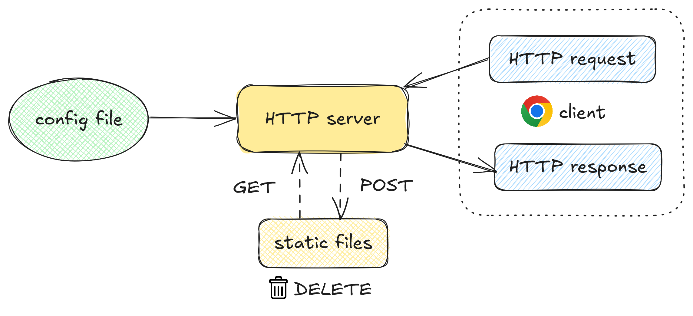

# 📖 Webserv
**Webserv** is a fully functional HTTP server written in **C++98**, designed to deepen understanding of network programming and the HTTP protocol. This project involves implementing essential web server functionality from scratch, including handling connections, parsing HTTP requests, generating responses, and supporting configuration-based behavior.

The server supports the **GET**, **POST**, and **DELETE** methods, serves static websites, allows file uploads, and is compatible with modern browsers. Configuration is done through a JSON-based file, inspired by the structure of NGINX, allowing specification of ports, hosts, server names, error pages, client body size limits, and route-specific behaviors (e.g., allowed methods, redirection, directory listing, CGI execution).

<p align="center">
  
</p>

[`Credit`](https://github.com/42-mates/webserv/)

## 📦 Installation & Usage

🖥️ **System:** Linux

🛠️ **Requirements:** C++98 compiler, Make

```bash
git clone https://github.com/42-mates/webserv.git
cd webserv
make
```
or
```
docker compse up --build
```
- Run in foreground:
```bash
# with default configuration
./webserv

# with a custom configuration file
./webserv config/redirection.json
```
This will show server logs directly in the terminal.
To interact with the server (e.g., using `curl` or browser), open **another terminal**.

- Run in background:
```bash
./webserv config/config.json &
```
This runs the server in the background, allowing you to use the same terminal for other tasks.
Use `fg` or `kill` if you need to bring it back or stop it.

<br><br>
<details>
  <summary>
    
## Grok: Where to start
Roadmap given by AI Grok:
  </summary>

<details>
  <summary>
    
### Step 1: Understand the Foundations
Before jumping into coding, you need to grasp the concepts and tools involved. This will save you headaches later.
  </summary>

#### 1. Learn What an HTTP Server Does
- Read about HTTP basics (requests, responses, status codes, headers). Start with something simple like [MDN’s HTTP Overview](https://developer.mozilla.org/en-US/docs/Web/HTTP/Overview).
- Focus on HTTP 1.1 since NGINX is your reference, and the project mentions it. Key topics: GET, POST, DELETE methods, status codes (e.g., 200 OK, 404 Not Found), and headers (e.g., Content-Length).
#### 2. Study the RFC 2616 (HTTP 1.1)
- The project says to read the RFC (Request for Comments). RFC 2616 is the official spec for HTTP 1.1. It’s dense, so don’t try to memorize it—just skim it to understand request/response formats, methods, and how servers should behave. You can find it online (e.g., [ietf.org](https://datatracker.ietf.org/doc/html/rfc2616)).
- Pay attention to Sections 5 (Request), 6 (Response), and 9 (Methods).
#### 3. Experiment with Telnet and NGINX
- The project suggests testing with Telnet and NGINX. Why? To see HTTP in action. <br>
  - Install NGINX locally (e.g., `sudo apt install nginx` on Linux).
  - Start NGINX and visit `localhost` in your browser to see a basic static site.
  - Use Telnet (`telnet localhost 80`), type `GET / HTTP/1.1` then hit Enter twice, and watch the raw HTTP response. This shows you how a server talks to clients.
- Compare NGINX’s behavior (headers, error pages) to what you’ll need to implement.
#### 4. Brush Up on C++ 98 and Systems Programming
- Since you’re restricted to C++ 98, review its basics (no modern C++11+ features like `auto` or smart pointers). Focus on classes, manual memory management (`new`/`delete`), and standard libraries.
- Learn the allowed system calls (e.g., `socket`, `accept`, `poll`, `read`, `write`). These are POSIX functions for networking and I/O—check their man pages (e.g., `man 2 socket` on Linux).
</details>

---

<details>
  <summary>
 
### Step 2: Plan Your Project Structure
Break the project into components based on the requirements. This will guide your coding later.    </summary>

#### 1. Configuration Parser
- Your server takes a config file (like NGINX’s `nginx.conf`). Plan to write a parser that reads this file and stores settings (e.g., port, host, routes, error pages).
- Start simple: a file with a `port` and `root` directory for static files.
#### 2.Networking Core
- Use `socket`, `bind`, `listen`, and `accept` to handle incoming connections.
- Implement non-blocking I/O with `poll()` (or `select()` if you prefer). This is the heart of the server—all I/O must go through it.
#### 3.HTTP Request/Response Handling
- Parse incoming HTTP requests (method, path, headers).
- Generate responses (status line, headers, body) based on the request and config.
#### 4.Static File Serving
- Serve files from a directory (e.g., `/tmp/www/index.html`) for GET requests.
#### 5.CGI Support
- Handle dynamic content (e.g., PHP scripts) using `fork`, `execve`, and pipes. This is for later, but plan for it.
#### 6.Error Handling and Resilience
- Default error pages (e.g., 404, 500).
- Ensure the server doesn’t crash under stress or bad requests.
</details>

---

<details>
  <summary>
 
### Step 3: Set Up Your Environment
Get your tools ready so you can test as you go.     </summary>

#### 1. Development Setup
- Use a Linux/Unix-like system (e.g., Ubuntu) since the system calls (e.g., `poll`, `epoll`) work best there.
- Install a C++ 98 compiler (e.g., `g++ -std=c++98`).
- Set up a basic `Makefile` with `all`, `clean`, `fclean`, and `re` targets.
#### 2. Testing Tools
- Browser (e.g., Chrome) to test compatibility.
- `curl` or `wget` for command-line requests.
- Telnet for raw HTTP testing.
- A simple static site (e.g., an `index.html` file) to serve initially.
</details>

---

<details>
  <summary>
 
### Step 4: Start Coding (Baby Steps)
Begin with the simplest working version and build up.
  </summary>

#### 1. Minimal Server (Hello World)
- Write a program that:
  - Creates a socket (`socket()`).
  - Binds it to a port (`bind()`, e.g., 8080).
  - Listens for connections (`listen()`).
  - Accepts a client (`accept()`).
  - Sends a hardcoded "HTTP/1.1 200 OK" response with "Hello, World!" as the body.
- Test it with curl `localhost:8080`.
#### 2. Add Non-Blocking I/O with poll()
- Make sockets non-blocking (`fcntl(sockfd, F_SETFL, O_NONBLOCK)`).
- Use `poll()` to handle multiple clients without blocking.
#### 3. Parse a Config File
- Start with a basic file (e.g., port 8080; root ./www;) and read it line-by-line.
#### 4. Serve a Static File
- Replace the "Hello, World!" with contents of an `index.html` file using `open` and `read`.
</details>

---

<details>
  <summary>
 
### Step 5: Iterate and Expand
Once the basics work, add features incrementally.
  </summary>
  
1. Parse HTTP requests properly.<br>
2. Support GET, POST, DELETE methods.<br>
3. Handle file uploads (POST).<br>
4. Add CGI for dynamic content.<br>
5. Implement multiple ports and routes from the config.
</details>

---

### Tips to Succeed
1. **Read the Man Pages**: For every system call (e.g., `man 2 poll`), understand arguments and return values.
2. **Test Early, Test Often**: Use `curl`, browsers, and stress tests (e.g., Python scripts sending tons of requests).
3. **Compare with NGINX**: When in doubt, see how NGINX handles a request or config setting.
4. **Debugging**: Use `strerror(errno)` for errors, but remember not to check `errno` after I/O calls per the rules.
5. **Time Management**: This project is big—start small and aim to finish core features first (static serving, config parsing).
</details>
</details>

<br><br>
##### Resources
- [`Reference`](https://github.com/BenjaminHThomas/WebServer) <br>
